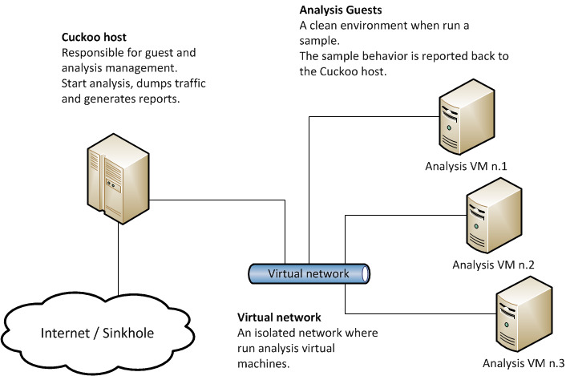

# CAPEv2 Configuration and Setup Scripts

<!-- Github repo link -->
[CAPEv2 GitHub](https://github.com/kevoreilly/CAPEv2)
[CAPEv2 Docker GitHub](https://github.com/celyrin/cape-docker)

## Introduction

CAPE is an open-source malware sandbox.

A sandbox is used to execute malicious files in an isolated enviornment whilst instrumenting their dynamic behaviour and collecting forensic artefacts.

CAPE was derived from Cuckoo v1 which features the following core capabilities on the Windows platform:

- Behavioral instrumentation based on API hooking

- Capture of files created, modified and deleted during execution

- Network traffic capture in PCAP format

- Malware classification based on behavioral and network signatures

- Screenshots of the desktop taken during the execution of the malware

- Full memory dumps of the target system

CAPE complements Cuckoo’s traditional sandbox output with several key additions:

- Automated dynamic malware unpacking

- Malware classification based on YARA signatures of unpacked payloads

- Static & dynamic malware configuration extraction

- Automated debugger programmable via YARA signatures, allowing:

    - Custom unpacking/config extractors

    - Dynamic anti-sandbox countermeasures

    - Instruction traces

- Interactive desktop

## Use case

It can be used to analyze:

- Generic Windows executables

- DLL files

- PDF documents

- Microsoft Office documents

- URLs and HTML files

- PHP scripts

- CPL files

- Visual Basic (VB) scripts

- ZIP files

- Java JAR

- Python files

- Almost anything else

## Architecture

CAPE Sandbox consists of central management software which handles sample execution and analysis.

Each analysis is launched in a fresh and isolated virtual machine. CAPE’s infrastructure is composed of a Host machine (the management software) and a number of Guest machines (virtual machines for analysis).

The Host runs the core component of the sandbox that manages the whole analysis process, while the Guests are the isolated environments where the malware samples get safely executed and analyzed.

The following picture explains CAPE’s main architecture:

## Scripts & Configuration Files

- `Vagrant`: Configuration file for auto download, install, setup and configure Windows 10 Virtual Machine on VirtualBox (Guest system for the Sandbox host).
- `run-vm.sh`: Power on the virtual machine in current working directory with the configuration file `Vagrant`.
- `reload-vm.sh`: Restart the virtual machine and update the newest config from configuration file without remove the VM. The `--provision` argument will make the VM executes init provision script from configuration file.
- `network-init.sh`: Set up the network for the virtual machine. The script will first check the configuration of the virtualbox for the allow to use all network address. If the configuration is not set, the script will set the configuration. Then the script will create a new host-only network adapter for the virtual machine with the name `vboxnet0` and the IP address `192.168.23.1` and the netmask `255.255.255.0` if the network adapter is not exist.
- `snapshot-vm.sh`: Create a snapshot for the `cybersec_windows_10` virtual machine with the name `snapshot1`.
- `cape-docker.sh`: Run the CAPEv2 docker container with the name `cape`.
